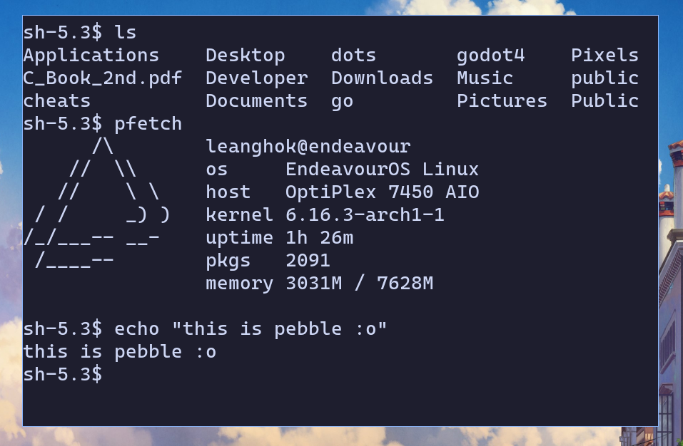

# pebble

pebble is a tiny terminal emulator written in C with Xlib, Xft and libvterm. pebble is not meant
to be a daily driver, it's just a small little project i built for fun :3



## features

- spawns your default shell inside a pty
- parses ANSI escape codes via libvterm
- draws text with Xft
- minimal codebase you can actually read without crying

## dependencies

- libvterm
- libx11
- libxft

## installation

clone the repo and run:

```
sudo make
```

## usage

just run :

```
pebble
```

## license

pebble uses the MIT license. go have fun and do whatever you want with it.
